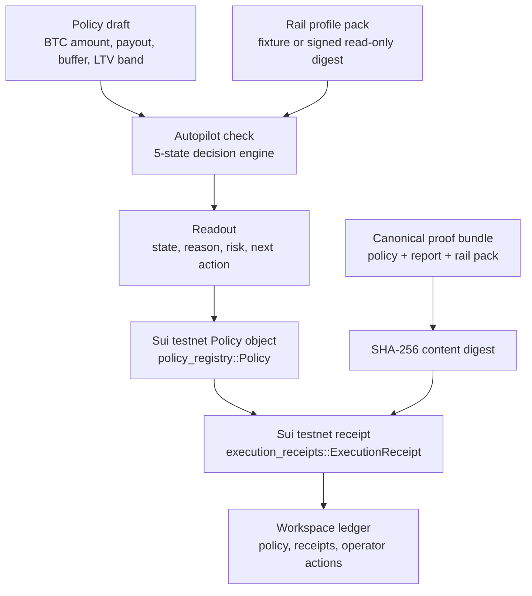

# TIDE Autopilot Rehearsal — Architecture

This document is the short judge-facing version. It separates what is live on
Sui testnet from what is a roadmap item.

## System Shape

## Load-Bearing Objects

### Policy

The Move policy object records:

- owner;
- selected rail;
- policy version;
- max LTV;
- target LTV low/high;
- repay and emergency thresholds;
- payout target;
- minimum buffer.

Versioning matters because receipts must point at the policy version they were
created against.

### Execution Receipt

The Move receipt object records:

- `policy_id`;
- `policy_version`;
- selected rail;
- `rail_pack_digest`;
- `content_digest`;
- proof reference;
- creation time.

At mint time the module re-checks the rail allowlist. If the rail was revoked
after the browser built the bundle, mint aborts.

### Proof Bundle

The browser creates canonical JSON for the policy/report/rail-pack tuple and
hashes it. Walrus durable upload is runtime-configured and exercised in the
2026-05-07 proof pack with real testnet blob IDs. Future runs fall back to an
explicit `tide-stub://testnet/sha256/<digest>` boundary when the publisher is
absent or fails.

## Decision Engine

The policy engine maps each run to one of five states:

1. `Observe` — no action required.
2. `Maintain` — policy remains inside the operating band.
3. `BuildBuffer` — buffer needs reinforcement.
4. `DeRisk` — LTV or stress path requires defensive action.
5. `StressLockdown` — emergency state; new payouts should stop.

The product flow shows the state and why it was selected. That is the core of the
Autopilot Rehearsal: decision + reason + receipt, not autonomous mainnet
execution.

## Judge Demo Routes

The public judge flow has four URL-level entry points. They are intentionally
seeded scenarios, not hidden production shortcuts:

- `/setup?judge=1` — Harbor starter, the default end-to-end path.
- `/setup?judge=stress` — drawdown-heavy path for DeRisk / StressLockdown
  explanation.
- `/setup?judge=revoke` — operator-side revoked-rail rehearsal. The
  on-chain revoke/mint fail-close proof remains in the CLI proof pack.
- `/setup?judge=oracle-stale` — oracle-confidence rehearsal for signed-source
  and freshness copy. The URL name remains stable for already shared links.

All routes produce a normal Readout and preserve `?judge=*` into the Results
URL so the side-by-side "manual treasury ops vs TIDE" frame can be reviewed
without hidden state.

## Trust Boundary

- The browser verifies signed rail packs before treating them as trusted.
- The wallet signs every on-chain action.
- The ops server does not hold user keys.
- The Move package records the policy and receipt.
- The proof bundle digest is pinned on-chain.
- Mainnet signing is build-gated and out of scope for the Overflow demo.

## What Is Real Today

- Sui testnet policy object.
- Sui testnet receipt object.
- Rail allowlist re-check at mint.
- Policy version freshness check.
- Content digest pin.
- Workspace policy/receipt ledger.
- Shadow Mode decision engine and stress simulation.

## Guard Evidence

The latest proof pack records five positive runs across Scallop, NAVI, Suilend,
and Bucket rail profiles plus the guard posture below:

- **N1 rail mismatch** — automated CLI negative check calls `mint_receipt` with
  a mismatched `expected_rail`; Move aborts with code `5`.
- **N2 revoked rail** — automated CLI negative check revokes a rail, confirms
  `select_rail` fails closed, revokes the selected rail, confirms
  `mint_receipt` fails closed, then re-allows both rails during cleanup.
- **N3 stale policy version** — Move regression
  `execution_receipts_tests::mint_receipt_rejects_stale_policy_version` covers
  stale policy behavior. An on-chain testnet repro needs the next package/schema
  upgrade drill.
- **N6 content digest mismatch** — the local verifier mutates a load-bearing
  proof-bundle field after mint and rejects it with `digest-mismatch`.
- **N7 stale proof bundle** — the local verifier rewinds `createdAtMs` past the
  freshness window and rejects the bundle as stale before it can be presented
  as current evidence.

## What Is Next

- Keep proof-bundle Walrus uploads fresh; the 2026-05-07 proof pack records
  five real Walrus testnet blob IDs, and future proof refreshes must preserve
  that non-stub storage path.
- One real testnet rail SDK path behind explicit signing gates.
- External Move/security audit.
- Mainnet Live Autopilot only after audit, legal, and operational controls.

## Action Receipt RFC

The lightweight proposal in `docs/overflow_2026/RFC-0001-action-receipt-schema.md` frames
TIDE action receipts as an ecosystem-readable evidence format. It is a draft
proposal, not an official Sui standard and not a compliance claim. Keep that
boundary visible in every public mention.

## Diagram export procedure

The mermaid block above is the source of truth for the submitted architecture
diagram. Export it through either path:

1. Paste the block into https://mermaid.live and export SVG.
2. Or run `npx --yes @mermaid-js/mermaid-cli mmdc -i docs/overflow_2026/architecture.md -o docs/overflow_2026/architecture.svg`
   for the CLI path. Do not add `@mermaid-js/mermaid-cli` as a permanent
   package dependency.

Verification checklist:

- the exported SVG opens in a browser;
- every node is visible: Draft, Rails, Check, Readout, Policy, Bundle,
  Digest, Receipt, Workspace;
- the diagram does not leak decision states as if they were Move receipt
  action labels;
- the Submission payload uses the same architecture.svg that this document
  describes.

When to re-export:

- any node label changes;
- the receipt schema or proof-bundle boundary changes;
- the Sui/Walrus/Pyth integration boundary changes;
- before every final submission deadline.
